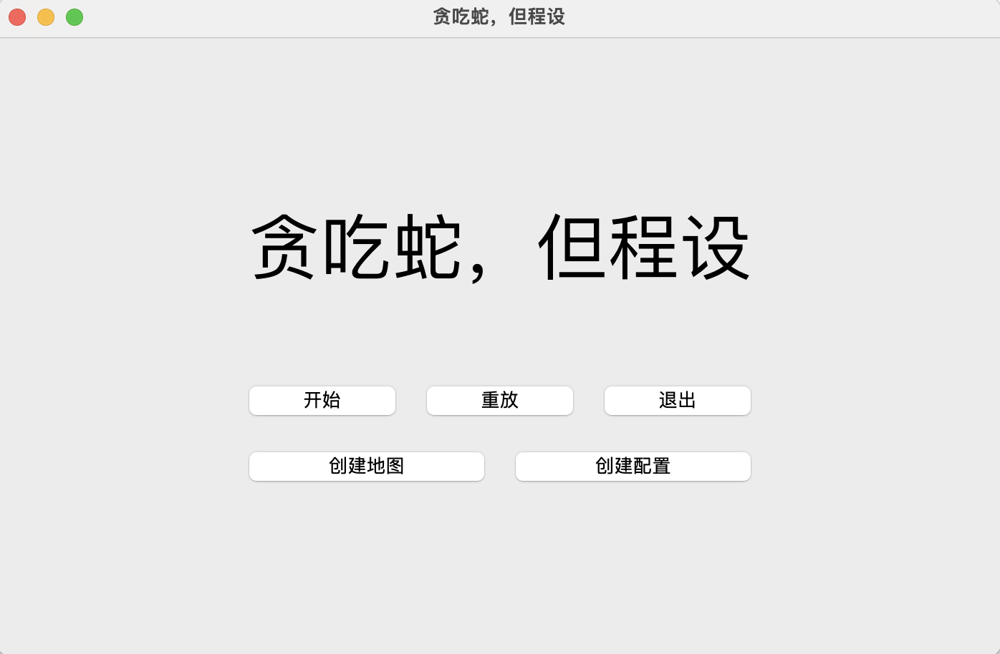

# 《贪吃蛇，但程设》项目报告

#### 《程序设计基础》2023秋，兴军亮老师课堂

## 一、成员及分工

- #### 董业恺

负责游戏逻辑、地图编辑器、UI优化，重构代码框架（解耦合），默认地图绘制，代码优化，git维护

- #### 王浩然

负责UI逻辑、配置编辑器、游戏、回放逻辑，UI重构，文件操作，代码重写、优化，报告主要撰写

## 二、项目运行环境

- **系统版本**

  1. MacOS Sonoma 14.0
  2. Windows 10
  3. Ubuntu 22.04

- **编译器版本**

  1. ```
     Qt 6.5.2 On Mac
     Apple clang version 15.0.0 (clang-1500.0.40.1)
     Target: arm64-apple-darwin23.0.0
     Thread model: posix
     ```

  2. ```
     Qt 6.6.0 On Windows
     g++ (x86_64-posix-seh-rev3, Built by MinGW-W64 project) 11.2.0
     Copyright (C) 2021 Free Software Foundation, Inc.
     ```

  3. ```
     Qt 6.6.0 On Linux
     ```

- **最低C++标准：** C++ 17

- **注：** 默认maps/config/records文件夹位于可执行文件所在目录

## 三、功能实现

项目由Qt实现GUI，页面间以继承方式切换。项目文件树主要部分如下

```text
SnakeFoP
├── climain.cpp
├── config
│   ├── classic.cfg
│   └── default.cfg
├── configeditor.{cpp,h,ui}
├── configmanager.{cpp,h}
├── game.{cpp,h}
├── gamecanvas.{cpp,h,ui}
├── main.cpp
├── mapeditor.{cpp,h,ui}
├── mapmanager.{cpp,h}
├── maps
│   ├── Belting.map
│   ├── Borders.map
│   ├── Chain and Portal.map
│   ├── Classic.map
│   ├── Is that Windows.map
│   ├── Maze.map
│   ├── Neq.map
│   ├── X.map
│   └── default.map
├── playpage.{cpp,h,ui}
├── recordmanager.{cpp,h}
├── replaypage.{cpp,h,ui}
├── resultpage.{cpp,h,ui}
├── settingpage.{cpp,h,ui}
└── widget.{cpp,h,ui}
```

下面对其进行解释

### **`recordmanager`：记录管理器**

- `Record` 类设置如下

    ```cpp
    struct Record {
        string name;
        Map map;
        Config config;
        string sequence;
        vector<int> timestamp;
        vector<pair<Point, int> > foodSequence;
        string moveSequence;
    };
    ```
    
  - 文件格式解释如下

    ```text
    1 配置信息, 由于存储配置文件路径无法保证在文件改变时仍能正确回放, 故此处将配置文件压缩为 1 行直接存储

    2 地图信息, 同理直接用 1 行存储

    3 - n 每一个动作的信息, 格式为 (动作名 时间戳 附加信息)
    对于生成食物, 动作名为 F, 附加信息为食物坐标和分数
    对于移动, 动作名为 M, 附加信息为移动方向, Q 代表结束
    ```

  - `RecordManager` 类设置如下

    ```cpp
    class RecordManager {
    public:
    		static Record LoadRecord(const string &path, Record &);
    		static void SaveRecord(const string &path, const Record &record);
    };
    ```
    
  - 主要函数：

    - `LoadRecord`：从指定路径中加载记录文件（未列出错误检查）
    
    - `SaveRecord`：将记录文档保存至指定路径（未列出错误检查）

### **`configmanager`：配置管理器**

  - `Config`类设置如下

    ```cpp
    struct Config {
        int level;
        int randomSeed;
        int foodCount;
        array<float, 3> foodProbabilities;
    };
    ```
    
  - `ConfigManager`类设置如下
  
    ```cpp
    class ConfigManager {
    private:
        static Config LoadConfigFromStream(istream &stream);
    public:
        static Config LoadConfig(const string &path);
        static Config LoadConfigFromString(const string &configString);
        static void SaveConfig(const string &path, const Config &config);
        [[nodiscard]] static string GetConfigString(const Config &config);
    };
    ```
    
  - 主要函数：

    - `LoadConfig`：从指定路径中加载配置文件
    - `SaveConfig`：将配置文档保存至指定路径
  
    考虑到游戏记录中需包含配置信息，编写函数将配置以字符串形式存储

    - `LoadConfigFromString`：从`string`中读取配置，保存为`Config`
    - `GetConfigString`：将`Config`压缩成`string`类型
  
### **`mapmanager`：地图管理器**

  - `Map`类设置如下

    ```cpp
    struct Map {
        int width, height;
        // Top, bottom, left, right
        array<bool, 4> borderIsObstacle;
        vector<Point> obstacles;
        vector<array<Point, 2>> portals; // 传送口
        Point spawnPoint; // 起始位置
    };
    ```
  
  - `MapManager`类设置如下
  
    ```cpp
    class MapManager {
    private:
        static Map LoadMapFromStream(istream &stream);
    public:
        static Map LoadMap(const string &path);
        static Map LoadMapFromString(const string &mapString);
        static void SaveMap(const string &path, const Map &map);
        [[nodiscard]] static string GetMapString(const Map &map);
    };
    ```
  
  
  - 主要函数：与`configmanager`类似
  
### **`configeditor`：配置编辑器**

  - 主要函数如下

    ```cpp
    private slots:
        void OnNewConfigButtonClicked(); // 创建配置
        void OnLoadConfigButtonClicked(); // 加载配置
        void OnSaveConfigButtonClicked(); // 保存配置
        void OnFoodProbability1ValueChanged(int value); // 修改食物1概率
        void OnFoodProbability2ValueChanged(int value); // 修改食物2概率
    ```

    

  <center>
    
    <br>
    <div>
      <b>配置编辑器效果图（P(食物3)=1-P(食物1)-P(食物2)）</b>
    </div>
  </center>

### **`mapeditor`：地图编辑器**

  - 除与`configeditor`类似函数外，主要函数如下，具体实现在`playpage`处讲解

    ```cpp
    private slots
        void OnMapXBorderChanged(bool blocking); // 水平边界设置
        void OnMapYBorderChanged(bool blocking); // 垂直边界设置
        void OnObstaclePainterButtonToggled(bool checked); // 障碍设置
        void OnEraseButtonToggled(bool x); // 清除地图
        void OnAddPortalButtonToggled(bool x); // 增加传送点
        void OnSetSpawnPointButtonToggled(bool x); // 初始点设置
    private:
        void UpdateCanvas(); // 重绘地图，非槽函数
        void OnObstaclePainterMouseSelect(int x, int y, bool rightButton); // 选中障碍
        void OnEraseMouseSelect(int x, int y); // 待删除点选中
        void OnAddPortalMouseSelect(int x, int y); // 传送点选中
        void OnSetSpawnPointMouseSelect(int x, int y); // 初始点选中
    ```

    

<center>
  
  <br>
  <div>
    <b>地图编辑器效果图</b>
  </div>
</center>	

### **`gamecanvas`：游戏棋盘**

  - `GameCanvas`类主要部分如下

    ````cpp
    class GameCanvas : public QWidget {
    private:
        const static QColor portalColors[]; // 存储传送点颜色，共10种
        const Game *game{};
        std::function<void(int, int, bool)> onMouseSelect;
        void SetGame(const Game *_game);
        void SetOnMouseSelect(std::function<void(int, int, bool)>);
    public slots:
        void paintEvent(QPaintEvent *event) override;
        void mousePressEvent(QMouseEvent *event) override;
        void mouseMoveEvent(QMouseEvent *event) override;
    };
    ````

### **`game`：游戏主体逻辑**

  - `game`主要定义如下

    ```cpp
    class Game {
    public:
        enum Direction {Right = 0, Down = 1, Left = 2, Up = 3};
        enum State {Alive, Dead};
    private:
        default_random_engine random;
        int mode; // 游戏模式，0代表游戏模式，1代表回放模式，2代表只显示
        struct GameStatus {
            const Map mapDefinition;
            const Config config;
            Direction direction;
            Direction preDirection;
            State state;
            int score, length, desiredLength;
            vector<vector<Point>> map;
            vector<vector<Point>> portal;
            vector<Point> foods;
            Point head, tail;
        } status;
    public:
        class SpecialPoint {
        public:
            constexpr static Point Empty{-4, 0}, Obstacle{-1, 0}, Head{-3, 0}, Food{-5, 0}; // 特殊点定义
        };
    public
        bool ChangeDirection(Direction direction); // 方向不合法时返回false
        int Step(Widget *widget); // 更新游戏状态
        [[nodiscard]] const GameStatus &GetStatus() const;
        [[nodiscard]] string GetStatisticsString() const;
        int GenerateFood(Widget *widget);
        void UpdateFood(Widget *widget);
    }
    ```

    其中，`map`定义如下

    ```
    利用地图中每一点的x,y值均大于等于0，将x值小于0的点设置为特殊点（见SpecialPoint）
    考虑Point p{x,y}，
    如果p指向(x,y)，即map[x][y]=p（注意此时x>=0,y>=0），表示p点被蛇占用
    如果map[x][y].x=-3，表示p点是蛇头
    如果map[x][y].x=-4，表示p点为空地
    如果map[x][y].x=-2，表示p点指向传送点
    如果map[x][y].x=-5，表示p点是食物，map[x][y].y是食物的分值
    ```

    `portal`定义如下

    ```
    考虑Point p{x1,y1}，
    如果map[x1][y1].x=-4，表示p不是传送点
    否则若portal[x1][y1]=Point{x2,y2}，表示p传送到(x2,y2)
    ```

  - 主要函数为`Step`，每一帧执行一次，有删减

    ```cpp
    int Game::Step(Widget *widget) {
        if (state == Dead) {throw runtime_error("The snake is dead");}
    		// 计算下一时刻的蛇头位置
      	Point nextHead = head;
        switch (direction) {
            case Right: nextHead.x++; break;
            case Down: nextHead.y++; break;
            case Left: nextHead.x--; break;
            case Up: nextHead.y--; break;
            default: break;
        }
        if (nextHead.x < 0 || nextHead.x >= mapDefinition.width) {
            // 碰到垂直边界
            if (mapDefinition.borderIsObstacle[2] || mapDefinition.borderIsObstacle[3]) {
                state = Dead;
                return 0;
            }
            // 碰到可传送边界
            if (nextHead.x < 0) nextHead.x = mapDefinition.width - 1;
            else nextHead.x = 0;
        }
    				// 碰到水平边界同理，略
      
        // 是否碰到传送点
        if (portal[nextHead.x][nextHead.y] != SpecialPoint::Empty) nextHead = status.portal[nextHead.x][nextHead.y];
    		// 是否碰到障碍
      	if (map[nextHead.x][nextHead.y].x == SpecialPoint::Obstacle.x) {
            state = Dead;
            return 0;
        }
        // 碰到自己，注意尾部不能是头部
        if (map[nextHead.x][nextHead.y].x != SpecialPoint::Empty.x
            && map[nextHead.x][nextHead.y].x != SpecialPoint::Food.x
            && !(nextHead == tail && status.desiredLength == status.length)) {
            state = Dead;
            return 0;
        }
    
        // 是否碰到食物
        if (map[nextHead.x][nextHead.y].x == SpecialPoint::Food.x) {
            status.score += map[nextHead.x][nextHead.y].y;
            status.desiredLength += map[nextHead.x][nextHead.y].y;
            status.foods.erase(find(status.foods.begin(), status.foods.end(), nextHead));
            if (mode == 0) tot = GenerateFood(widget);
        }
    
        // 移动
        Point nextTail = map[tail.x][tail.y];
        // 变长
        if (status.length < status.desiredLength) ++status.length;
    		// 或向前
      	else {
            map[tail.x][tail.y] = SpecialPoint::Empty;
            tail = nextTail;
        }
        map[head.x][head.y] = nextHead;
        head = nextHead;
        map[head.x][head.y] = SpecialPoint::Head;
        return tot;
    }
    ```

### **`widget`：主界面**

  <center>
    
    <br>
    <div>
      <b>主界面效果图</b>
    </div>
  </center>	

### **`settingpage`：游戏设置界面，略**

### **`playpage`：游戏界面**

  - `GameOver`函数

    ```cpp
    void PlayPage::GameOver() //主要涉及记录保存 {
    		gameTimer->stop();
        qint64 timestamp = QDateTime::currentMSecsSinceEpoch();
        QDateTime dateTime;
        dateTime.setMSecsSinceEpoch(timestamp);
        QString format = "yyyy-MM-dd-hh-mm-ss";
        QString formattedDateTime = dateTime.toString(format);
        try {
            RecordManager::SaveRecord(
                QDir(QCoreApplication::applicationDirPath()).filePath("records/" + formattedDateTime + ".rec")
                    .toStdString(), widget->GetRecord());
        } catch (exception &e) {
            QMessageBox::warning(this, "保存回放错误", e.what());
            this->hide();
            widget->show();
            return;
        }
        // 判断是否结束
        if (resultPage->exec() == QDialog::Accepted) {
            widget->show();
            this->hide();
        } else {
            this->done(0);
            widget->close();
        }
    }
    ```

  <center>
    
    <br>
    <div>
      <b>游戏界面效果图</b>
    </div>
  </center>	

### **`replaypage`：回放界面**

  - `InitPlay`函数

    ```cpp
    bool ReplayPage::InitPlay(const QFileInfo &fileInfo) {
        curStep = 0;
        widget->SetMode(true);
        ui->RecordLabel->setText(fileInfo.fileName());
        Record tmp;
    		// 读取记录，playpage没有这一步
    		try {
            tmp = RecordManager::LoadRecord(fileInfo.filePath().toStdString(), widget->GetGameRecord());
        } catch (exception &e) {
            QMessageBox::warning(this, "打开地图错误", e.what());
            return false;
        }
        widget->ResetRecord();
        widget->ResetRecord(tmp);
        delete game;
        game = new Game(widget->GetMap(), widget->GetConfig(), 1, widget);
        ui->Canvas->SetGame(game);
        auto &status = game->GetStatus();
        game->SetStatus(Game::Alive);
        delete gameTimer;
        gameTimer = new QTimer(this);
        // 每帧行动
        connect(gameTimer, &QTimer::timeout, this, [&]() {
            if (widget->IsEnd()) {
                return;
            }
            // 更新蛇方向/生成食物
            while (!widget->IsEnd() && widget->GetCurrentStep() == curStep) Step();
            // 蛇移动
            if (!widget->IsEnd()) {
                ++curStep;
                game->Step(widget);
                ui->ScoreLabel->setText(QString::number(status.score));
                ui->LengthLabel->setText(QString::number(status.length));
                ui->Canvas->update();
            }
        });
        // 调整gameTimer的间隔，可以实现快进
        gameTimer->start((int) (TIME_INTERVAL / playRate * (1. / status.config.level)));
        return true;
    }
    ```
  
### **`resultpage`：结果界面，略**

  <center>
    
    <br>
    <div>
      <b>结束页效果图</b>
    </div>
  </center>	

### **`main`：游戏启动入口，采用Qt默认配置，略**

## 四、扩展功能

- #### 支持GUI地图绘制，而非手动输入坐标。绘制丰富地图更轻松

- #### 支持回放倍速，再也不用担心看不清蛇的轨迹了

- #### 设置传送点，蛇可以触此传送，增添游戏趣味性