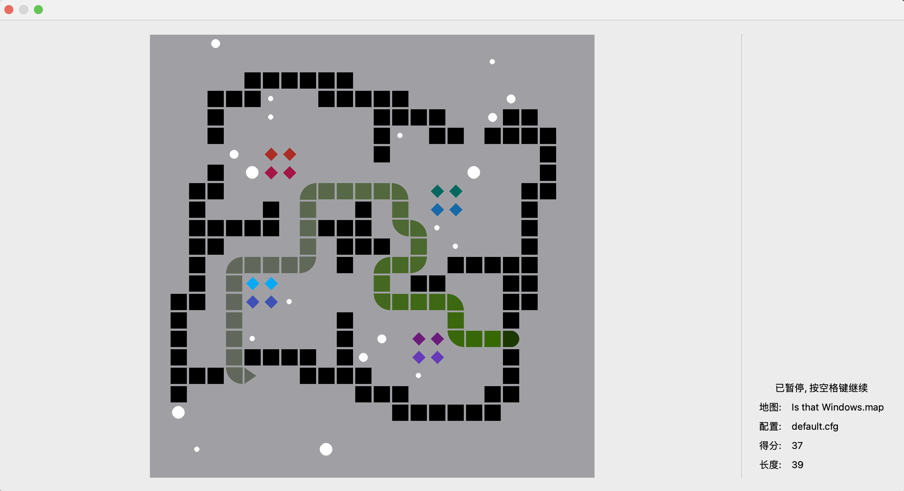

# 《贪吃蛇，但程设》项目报告

**《程序设计基础》2023秋，兴军亮老师课堂**

<div style="text-align: right;">董业恺 (Ajax, 2022010426), 王浩然 (Ubec, 2022010229)</div>

<div style="justify-content: center; text-align: center;">
  
</div>


## 〇、前言

*(这一段主要是董业恺写的, ~~所以攻击性比较强~~)*

### 我们是谁 (雾)

我和王浩然都是转系的同学. 我很早就接触程设了, 也系统学习过 OOP (虽然没上过课), 并有一定的 C++, C#, Java, TypeScript 开发经验, 系统接触过 git (谁让开发的时候一定要用呢...).

王浩然说他接触过 C++ 和 Qt 的开发, 学习过 OOP 课程, 会用 ~~(但只会一点, Ajax 评)~~ git.

我们都在计算机系科协. 在学期初的时候王浩然从科协的水群里面问我要不要组队, 我们就这么定下来了.

一开始的时候, 我们以为我们班的大作业和其他部分班级的是一样的, 所以他们布置了之后我们就直接开始写了... 结果写了一点之后发现不是这样的.

### 我们为什么选择 Qt

大作业的文档发布之后, 我们简要讨论了一下 UI 的选择.

我们首先对使用 GUI 还是 CLI (TUI) 进行了不到 1 分钟讨论. 结论是: **使用 GUI**. 原因如下:

- GUI 比 TUI 好写 (真的!) TUI 要对命令行的大小啥的一大堆进行处理, 还要对光标的位置啥的进行处理, 很多东西都要造轮子, 还不好看. GUI 有库帮我们处理这些事情, 逻辑更加简洁.
- GUI 不用处理大量 "非法输入". (这种无聊的代码有 Copilot 我都懒得写...)

然后我们讨论了使用什么 GUI 框架. 我们的选择是 Qt. 原因如下:

- 王浩然说他用过 Qt ~~(真的嘛... 我现在不觉得...)~~
- 王浩然用 Mac, 我用 Windows 和 Linux. 大部分 C++ GUI 库都不能跨平台 (如 WinForm, MFC), 我知道的一些库不会用 (如 GTK).
- Qt 有比较好的文档, 比较容易上手 ~~(但是为什么要说这个呢...)~~

### 我们的分工

然后我们进行了 **基本的分工**: **王浩然负责 UI, 我负责逻辑.** 并协商了 UI 和 逻辑间的接口.

显然, 实际上的分工并不是这样的.

一开始浩然哥哥写出来的 UI 让我眼前一黑... 然后我就半个小时速成了 QWidget 写法去改 UI 了...

然后由于我在改 UI, 为了避免 git merge conflict, 浩然哥哥就去开发独立的功能 (回放功能) 了. 由于浩然哥哥的开发经验没有我多 ~~(傲娇)~~, 回放功能一直有一些 Bug, 所以在较长的一段时间内浩然哥哥一直在改 Bug, 我在对 UI 进行调整优化.

到后面, 我发现逻辑的内容比 UI 少很多, 所以我又跑去写了地图编辑器.

项目大概写完了之后由于我强迫症, 我又改了不少 UI, 使得程序更好看了.

### 写项目时的趣事 (雾)

在写项目的过程中, 我发现浩然哥哥并没有那么会用 git, 出现了几次 git 的误操作. 在出现这样的问题时, 我会协助他解决, 使得这个项目没有出现过严重的 git 问题.

在测试项目的时候, 我发现了两个逻辑 Bug 但我印象里我都做了处理. 于是我去查 git blame 发现是浩然哥哥没看懂代码就改了... (**注释的重要性**)

在优化的时候我觉得之前的暂停功能的实现很粗糙, 问浩然哥哥为啥要这么写. 浩然哥哥说他没写. 我去查 git blame 发现是我写的...

由于我看不惯 warning, 我编译的时候会打开 `-Wall -Wextra` 并解决所有 warning. 于是我常常 push 浩然哥哥改他写的 warning. ~~(浩然哥哥太惨了)~~

### 为什么实现部分特殊功能

#### 传送门

问就是我看错文档要求了... 不过反正我的码力对付这个大小的项目有大量的富余, 实现起来也不难, 毕竟挺好玩的 (x

#### 重生点

不然没办法设计那些特殊的地图, 可能会直接撞在墙上

#### 各种默认地图

默认地图也是测试地图编辑器效果的一部分. 地图编辑器还是挺好用的

### 一点吐槽

Qt 的跨平台功能虽然有, 但确实不那么完善. 比如生成工程文件的时候要复制默认地图和默认配置文件, 但是在 Linux, MacOS, Windows 上的方式各不相同. 以及 Qt 在 Windows 上面的全部应用居然有 50MB...

## 一、成员及分工

### 董业恺

负责游戏逻辑、地图编辑器、UI优化，重构代码框架（解耦合），默认地图绘制，代码优化，git维护

### 王浩然

负责UI逻辑、配置编辑器、游戏、回放逻辑，UI重构，文件操作，代码重写、优化，报告主要撰写

## 二、项目运行环境

### 系统版本

1. MacOS Sonoma 14.0
2. Windows 11
3. Linux Mint 21.2

### 编译器版本

```text
Qt 6.5.2 On Mac
Apple clang version 15.0.0 (clang-1500.0.40.1)
Target: arm64-apple-darwin23.0.0
Thread model: posix
```

```text
Qt 6.6.0 On Windows
g++ (x86_64-posix-seh-rev3, Built by MinGW-W64 project) 11.2.0
Copyright (C) 2021 Free Software Foundation, Inc.
```
```text
Qt 6.6.0 On Linux
懒得看了 (x
```

### 最低C++标准：

C++ 17 (部分 Notation 是 C++ 17 标准的, 如 `[[nodiscard]]`)

**注：** 默认maps/config/records文件夹位于可执行文件所在目录

## 三、功能实现

项目由Qt实现GUI，页面间以继承方式切换。项目文件树主要部分如下

```text
SnakeFoP
├── climain.cpp
├── config
│   └── *.cfg
├── configeditor.{cpp,h,ui}
├── configmanager.{cpp,h}
├── game.{cpp,h}
├── gamecanvas.{cpp,h,ui}
├── main.cpp
├── mapeditor.{cpp,h,ui}
├── mapmanager.{cpp,h}
├── maps
│   └── *.map
├── playpage.{cpp,h,ui}
├── recordmanager.{cpp,h}
├── replaypage.{cpp,h,ui}
├── resultpage.{cpp,h,ui}
├── settingpage.{cpp,h,ui}
└── widget.{cpp,h,ui}
```

下面对其进行解释

### `recordmanager`：记录管理器

`Record` 类设置如下

```cpp
struct Record {
    string name;
    Map map;
    Config config;
    string sequence;
    vector<int> timestamp;
    vector<pair<Point, int> > foodSequence;
    string moveSequence;
};
```

文件格式解释如下：

```text
第1行 配置信息, 由于存储配置文件路径无法保证在文件改变时仍能正确回放, 故此处将配置文件压缩为 1 行直接存储

第2行 地图信息, 同理直接用 1 行存储

第3~n行 每一个动作的信息, 格式为 (动作名 时间戳 附加信息)
对于生成食物, 动作名为 F, 附加信息为食物坐标和分数
对于移动, 动作名为 M, 附加信息为移动方向, Q 代表结束
```

`RecordManager` 类设置如下

```cpp
class RecordManager {
public:
		static Record LoadRecord(const string &path, Record &);
		static void SaveRecord(const string &path, const Record &record);
};
```

主要函数：

- `LoadRecord`：从指定路径中加载记录文件（未列出错误检查）
  采用`ifstream`读取文件内容，主要操作如下

  ```cpp
  ifstream ifs(path);
  char buffer[1048576];
  ifs.getline(buffer, 1048576);
  if (!ifs.good()) {throw runtime_error("打开配置失败");}
  ```

- `SaveRecord`：将记录文档保存至指定路径（未列出错误检查）
  采用 `ofstream` 输出 `Config` 内容，主要操作如下

  ```cpp
  ofstream ofs(path);
  if(!ofs.is_open()) {throw runtime_error("文件操作异常");}
  string config = ConfigManager::GetConfigString(record.config);
  replace(config.begin(), config.end(), '\n', ' '); // 去掉换行符，保证config只占一行
  ofs << config << "\n";
  ```

### `configmanager`：配置管理器

`Config`类设置如下

```cpp
struct Config {
    int level;
    int randomSeed;
    int foodCount;
    array<float, 3> foodProbabilities;
};
```

`ConfigManager`类设置如下

```cpp
class ConfigManager {
private:
    static Config LoadConfigFromStream(istream &stream);
public:
    static Config LoadConfig(const string &path);
    static Config LoadConfigFromString(const string &configString);
    static void SaveConfig(const string &path, const Config &config);
    [[nodiscard]] static string GetConfigString(const Config &config);
};
```

主要函数包括：

- `LoadConfig`：从指定路径中加载配置文件
- `SaveConfig`：将配置文档保存至指定路径
  

考虑到游戏记录中需包含配置信息，编写函数将配置以字符串形式存储
    
- `LoadConfigFromString`：从`string`中读取配置，保存为`Config`。采用`stringstream`
- `GetConfigString`：将`Config`压缩成`string`类型。采用`stringstream`

### `mapmanager`：地图管理器

`Map`类设置如下

```cpp
struct Map {
    int width, height;
    // Top, bottom, left, right
    array<bool, 4> borderIsObstacle;
    vector<Point> obstacles;
    vector<array<Point, 2>> portals; // 传送口
    Point spawnPoint; // 起始位置
};
```

`MapManager`类设置如下

```cpp
class MapManager {
private:
    static Map LoadMapFromStream(istream &stream);
public:
    static Map LoadMap(const string &path);
    static Map LoadMapFromString(const string &mapString);
    static void SaveMap(const string &path, const Map &map);
    [[nodiscard]] static string GetMapString(const Map &map);
};
```

主要函数：与`configmanager`类似

### `configeditor`：配置编辑器

主要函数如下

```cpp
private slots:
    void OnNewConfigButtonClicked(); // 创建配置
    void OnLoadConfigButtonClicked(); // 加载配置
    void OnSaveConfigButtonClicked(); // 保存配置
    void OnFoodProbability1ValueChanged(int value); // 修改食物1概率
    void OnFoodProbability2ValueChanged(int value); // 修改食物2概率
```

由于在不同模式、目录中启动`Qt`可执行文件时，用`QDir`得到的目录不同，我们最终选择将`config`、`maps`、`records`保存到可执行文件同级目录中，以加载`config`为例，其余同理

```cpp
QString configFilePath = QFileDialog::getOpenFileName(this, tr("选择文件"));
// QCoreApplication::applicationFilePath()返回可执行文件所在目录
QDir(QCoreApplication::applicationFilePath()).filePath("config/"), tr("配置文件 (*.cfg)");
QFileInfo fileInfo = QFileInfo(configFilePath);
Config config{};
try {
    config = ConfigManager::LoadConfig(fileInfo.filePath().toStdString());
} catch (exception &e) {
    QMessageBox::warnings(this, "打开配置错误", e.what());
    return;
}
```

<div style="justify-content: center; text-align: center;">
  
  <br>
  <div>
    <b>配置编辑器效果图（P(食物3)=1-P(食物1)-P(食物2)）</b>
  </div>
</div>

### `mapeditor`：地图编辑器

除与 `configeditor` 类似函数外，主要函数如下, 大都是基本的 `GUI` 回调逻辑. 需要特别指出的一点是 mapEditor 通过 **传递函数参数** 给 `GameCanvas` 的方式实现 `OnObstaclePainterMouseSelect` 等鼠标回调, 以保存 `GameCanvas` 对自身属性计算 (如大小等) 的封装和保护.

```cpp
private slots:
    void OnMapXBorderChanged(bool blocking); // 水平边界设置
    void OnMapYBorderChanged(bool blocking); // 垂直边界设置
    void OnObstaclePainterButtonToggled(bool checked); // 障碍设置
    void OnEraseButtonToggled(bool x); // 清除地图
    void OnAddPortalButtonToggled(bool x); // 增加传送点
    void OnSetSpawnPointButtonToggled(bool x); // 初始点设置
private:
    void UpdateCanvas(); // 重绘地图，非槽函数
    void OnObstaclePainterMouseSelect(int x, int y, bool rightButton); // 选中障碍
    void OnEraseMouseSelect(int x, int y); // 待删除点选中
    void OnAddPortalMouseSelect(int x, int y); // 传送点选中
    void OnSetSpawnPointMouseSelect(int x, int y); // 初始点选中
```

<div style="justify-content: center; text-align: center;">
  
  <br>
  <div>
    <b>地图编辑器效果图</b>
  </div>
</div>	

### `gamecanvas`：游戏棋盘

`GameCanvas`类主要部分如下

```cpp
class GameCanvas : public QWidget {
private:
    const static QColor portalColors[]; // 存储传送点颜色，共10种
    const Game *game{};
    std::function<void(int, int, bool)> onMouseSelect;
    void SetGame(const Game *_game);
    void SetOnMouseSelect(std::function<void(int, int, bool)>);
public slots:
    void paintEvent(QPaintEvent *event) override;
    void mousePressEvent(QMouseEvent *event) override;
    void mouseMoveEvent(QMouseEvent *event) override;
};
```

主要函数为 `PaintEvent`，需要注意这里的对齐方式: 

`gamecanvas.ui` 将矩形画布的大小设置为 $[(0,0),(400,300)]$，即$400x300$的框；而每张地图的 $row,col$ 数不保证相同，这导致 $\dfrac{400}{row}=\dfrac{{300}}{col}$ 非恒成立。为了保证格子均为正方形，我们需要对原矩形画布进行裁剪。同时，由于窗口可以通过鼠标操作调整大小，画布的大小也需要动态调整。
    
先取格子数 $blozkSize=min(\dfrac{width}{row},\dfrac{height}{col})$ 

裁剪过后的宽度 $width=blockSize*row$，高度 $height=blockSize*col$

这样会产生误差。我们将裁剪后的矩形画布放到原画布中心位置，其左/右侧偏差 $xOffset=\dfrac{(size.width()-width)}{2}$，上/下偏差 $yOffset=\dfrac{(size.height()-height)}{2}$，除二是因为左右/上下均有误差且相等
    
需注意此后我们进行的蛇、食物、传送点、障碍绘制均基于原画布左上角，这意味着每次绘制时我们都需要相应地加上 $xOffset$，$yOffset$，如绘制障碍物
    

```cpp
auto obstacles = status.mapDefinition.obstacles;
for (const auto &obstacle: obstacles) {
    painter.drawRect((int) (xOffset + margin + obstacle.x * blockSize),
        (int) (yOffset + margin + obstacle.y * blockSize),
        (int) (blockSize - margin), (int) (blockSize - margin));
}
```

枚举每个正方形的左上、右下点坐标即可。注意到绘制时还出现了margin，其定义如下

```cpp
constexpr double BLOCK_MARGIN = 0.05;
const double margin = blockSize * BLOCK_MARGIN;
```

由于游戏支持设置四个边界是否可传送，我们需要在 `gamecanvas` 中体现出边界是否可传送，故需留出边框线位置，`margin` 即是方格距边界的距离。

### `game`：游戏主体逻辑

`game`主要定义如下

```cpp
class Game {
public:
    enum Direction {Right = 0, Down = 1, Left = 2, Up = 3};
    enum State {Alive, Dead};
private:
    default_random_engine random;
    int mode; // 游戏模式，0代表游戏模式，1代表回放模式，2代表只显示
    struct GameStatus {
        const Map mapDefinition;
        const Config config;
        Direction direction;
        Direction preDirection;
        State state;
        int score, length, desiredLength;
        vector<vector<Point>> map;
        vector<vector<Point>> portal;
        vector<Point> foods;
        Point head, tail;
    } status;
public:
    class SpecialPoint {
    public:
        constexpr static Point Empty{-4, 0}, Obstacle{-1, 0}, Head{-3, 0}, Food{-5, 0}; // 特殊点定义
    };
public
    bool ChangeDirection(Direction direction); // 方向不合法时返回false
    int Step(Widget *widget); // 更新游戏状态
    [[nodiscard]] const GameStatus &GetStatus() const;
    [[nodiscard]] string GetStatisticsString() const;
    int GenerateFood(Widget *widget);
    void UpdateFood(Widget *widget);
}
```

其中，`map`定义如下:

  - 利用地图中每一点的x,y值均大于等于0，将x值小于0的点设置为特殊点（见 `SpecialPoint` 类）。考虑`Point p{x,y}`，
  
  - 如果`p`指向`(x,y)`，即`map[x][y]=p`（注意此时`x>=0`,`y>=0`），表示p点被蛇占用
  
  - 如果`map[x][y].x=-3`，表示p点是蛇头
  
  - 如果`map[x][y].x=-4`，表示p点为空地
  
  - 如果`map[x][y].x=-2`，表示p点指向传送点
  
  - 如果`map[x][y].x=-5`，表示p点是食物，`map[x][y].y`是食物的分值

这样的设计能够在 **常数时间** 内访问蛇尾和蛇头, 且能够在 **常数时间** 内完成蛇向前移动一步的操作. 同时, 这样的数据结构还允许在 **线性时间** 内完成从蛇尾到蛇头的遍历并获取坐标.

为了游戏的趣味性和拓展性 ~~(其实是因为 Ajax 在写 map 类的时候看错文档要求了)~~, 我们定义类传送门 `portal`:

一对传送门由两个点组成, 存储在 `Map::portals` 中, 当蛇 **将要走到某一端所在的格子** 时会被传送到 **另一端所在的格子**. 考虑 `Point p{x1,y1}`，如果
    `portal[x1][y1] == Point{x2, y2}`，表示 p 会被传送到 `(x2, y2)`

`Game` 主要函数为 `Step`，每一帧执行一次，有删减。需按 **逻辑顺序** 一步步写

  1. 首先判断蛇是否依然存活, 如果已经死亡, 抛出异常. 这样的处理可以尽量避免 UI 的逻辑错误. ~~(问就是写 UI 的时候这里一直抛异常)~~

     ```cpp
       if (state == Dead) { throw runtime_error("The snake is dead"); }
     ```

  2. 然后对下一时刻的蛇头位置进行计算, 但并不更新.

  3. 计算后:

     1. 首先检查蛇头是否出界, 防止越界访问导致异常. 如果出界了, 那么检查是否应该传送或者直接死亡.

     2. 此时蛇头一定在地图内, 然后检查是否碰到了传送点, 如果碰到了, 则将蛇头传送到另一端.

     3. 然后检查蛇头是否碰到了障碍物, 如果碰到了, 则直接死亡.

     4. 此时检查蛇头是否碰到了自己, 如果碰到了, 则直接死亡. 但是这里存在一个特例: 如果蛇头碰到了蛇尾, 那么在下一时刻蛇尾可能已经离开了. 此时蛇不应该死亡. **但是** 如果此时蛇的长度并不最大, 则蛇尾 **不会** 离开, 此时蛇应该死亡. 因此此处的判断为:

        ```cpp
        if (map[nextHead.x][nextHead.y].x != SpecialPoint::Empty.x
             && map[nextHead.x][nextHead.y].x != SpecialPoint::Food.x
             && !(nextHead == tail && status.desiredLength == status.length))
        ```

  4. 这时已经确定蛇存活了, 接下来检查是否碰到了食物, 如果碰到了, 则更新蛇的长度和分数, 并且将食物从食物列表中删除. 此处 Game 的模式会影响食物的生成: 如果是 **游戏模式**, 则会在食物被吃掉后重新生成, 如果是 **回放模式**, 则不会重新生成.

     ```cpp
     if (map[nextHead.x][nextHead.y].x == SpecialPoint::Food.x) {
         status.score += map[nextHead.x][nextHead.y].y;
         status.desiredLength += map[nextHead.x][nextHead.y].y;
         status.foods.erase(find(status.foods.begin(), status.foods.end(), nextHead));
         if (mode == 0) tot = GenerateFood(widget);
     }
     ```

  5. 此时终于可以移动蛇了. **首先** 更新蛇尾的位置, **然后** 更新蛇头的位置, 最后为了记录食物生成情况, 返回生成食物的数量.

### `widget`：主界面

为避免各界面间过度耦合，项目中没有使用全局变量，而是采用**以`widget`为基类，各`page`页面继承同一个`widget`的方式**，主要是`playpage`和`replaypage`共用。

`widget`类额外定义的主要接口及变量如下

```cpp
// 更新当前游戏记录，游戏/回放都需要
void ResetRecord(const Map &, const Config &); // 重放时需要
void ResetRecord(const Record &); // 重放时需要
void ResetRecord(); // 游戏时需要，以清空之前记录

// 游戏时用，更新当前记录
void UpdateRecordFood(int, int, int); 
void UpdateRecordMovement(char);
void UpdateTime(int);
void SetGameConfigPath(const QFileInfo &path);
void SetGameMapPath(const QFileInfo &path);
void SetMode(bool _mode);

// 回放时用，进行状态更新
char NextAction(); //
char GetCurrentAction();
int GetCurrentStep();
pair<Point, int> GetNextFood();
char GetNextMovement();
bool GetMode() const;
Record &GetGameRecord();
[[nodiscard]] Record GetRecord() const;
[[nodiscard]] bool IsEnd() const;

SettingPage *settingPage;
ReplayPage *replayPage;
PlayPage *playPage;

int seqPtr;
int movementPtr;
int foodPtr;
Record gameRecord;
```

而`settingpage`，`replaypage`，`playpage` 均含 `Widget *widget`。

如果不采用继承，需要定义全局变量，或在`widget`类里定义`static Record gameRecord`。限制应用多开，因为所有窗口都在共用同一个`record`；这也不便于本项目嵌入到其他游戏平台类项目中。

在`widget`初始化时，先将`{setting,replay,page}page`初始化，**将其`Widget`成员变量均设置为当前`widget`**，随后操作时只需**调用如`widget->NextAction()`** 即可

<div style="justify-content: center; text-align: center;">
  
  <br>
  <div>
    <b>主界面效果图</b>
  </div>
</div>	

### `settingpage`：游戏设置界面，略

### `playpage`：游戏界面

  - `GameOver`函数，主要涉及以时间戳命名，细节如下
  
    ```cpp
    qint64 timestamp = QDateTime::currentMSecsSinceEpoch(); // 获取当前时间戳，为qint64类型
    QDateTime dateTime;
    dateTime.setMSecsSinceEpoch(timestamp); // 将qint64时间戳转化为QDateTime格式
    QString format = "yyyy-MM-dd-hh-mm-ss";
    QString formattedDateTime = dateTime.toString(format); // 将QDateTime转化为指定格式串
    try {
        RecordManager::SaveRecord(
            QDir(QCoreApplication::applicationDirPath()).filePath("records/" + formattedDateTime + ".rec")
                .toStdString(), widget->GetRecord()); // 保存
    } catch (exception &e) {
        QMessageBox::warning(this, "保存回放错误", e.what());
        this->hide();
        widget->show();
        return;
    }
    ```

  <div style="justify-content: center; text-align: center;">
    
    <br>
    <div>
      <b>游戏界面效果图</b>
    </div>
  </div>	

### `replaypage`：回放界面

  - `InitPlay`函数
  
  - 每一次刷新时，先更新`curStep`时触发的方向改变/食物生成，再移动蛇

    ```cpp
    connect(gameTimer, &QTimer::timeout, this, [&]() {
        if (widget->IsEnd()) {return;}
        while (!widget->IsEnd() && widget->GetCurrentStep() == curStep) Step(); // 更新蛇方向/生成食物
        if (!widget->IsEnd()) /*蛇移动*/{
            ++curStep;
            game->Step(widget);
            ui->ScoreLabel->setText(QString::number(status.score));
            ui->LengthLabel->setText(QString::number(status.length));
            ui->Canvas->update();
        }
    });
    ```

### `resultpage`：结果界面，略

<div style="justify-content: center; text-align: center;">
  
  <br>
  <div>
    <b>结束页效果图</b>
  </div>
</div>	
### `main`：游戏启动入口，采用Qt默认配置，略

## 四、扩展功能

### 支持GUI，妈妈再也不用担心我不会用命令行啦

作为一款娱乐游戏，**SnakeFoP**无需高效的指令切换，而更需要的是美观与直接，因此GUI相比CLI是更优解。GUI由于采用了大量的图形元素，界面会更显得具有艺术性，富有人性化。相较于枯燥的文本来说，精致且合理的图形大大增强了界面的易用性，用户体验感++！

此外，我们认为GUI最大的便捷之处在于地图绘制。我们无需手动输入坐标，便可通过精妙的 GUI 设计绘制丰富地图。用户可以通过用鼠标在地图上拖动来绘制和擦除障碍物，也可以通过点击按钮来绘制边界、传送点、初始点。这种方式使得地图绘制更加直观，也更加容易上手。所有的样例地图都是通过这种方式绘制的。

<div style="justify-content: center; text-align: center;">
  
  <br>
  <div>
    <b>地图绘制功能</b>
  </div>
</div>

### 跨平台支持，Windows、MacOS、Linux 通吃

通过 Qt 的跨平台特性，我们的项目在 **Windows**、**MacOS**、**Linux** 上皆可运行。这样可以使得我们的项目更加方便地使用。薄纱使用` conio.h` 的控制台应用 （x

### 支持回放倍速，快慢皆在掌握之中

在回放时增加了倍速功能，可以通过调整`QDoubleSpinBox`的值来调整回放速度。这样可以更加方便地观察蛇的移动轨迹。若游戏进行时配置速度过慢，可加速大致观察；若速度过快，亦可减慢回放速度细细品味

### 设置传送点，赋予贪吃蛇传送属性，增添游戏趣味性

通过传送点设计，显著增加了贪吃蛇 AI 算法的难度，使得游戏更加具有挑战性。~~也因此我们没有实现 AI~~
